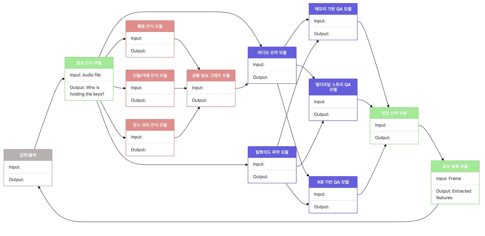

# visual-intelligence-viz
Real-time visualization of data flow for the Visual Intelligence Platform (VIP) realized in Node.js. We use socket.io to stream real-time updates of agent state to clients and dagre to visualize the data flow graph of modules. 



# Requirements

Requires a recent version of Node.js to run. Can be installed using your packet manager of choice. For instance on Ubuntu this can be done via:

```
sudo apt install nodejs
```

If you are using nvm to install and switch to the latest version:

```
nvm install node
nvm use node
```

Tested on Node.js version 14.5.0. It may work on older versions but YMMV. I would not recommend using very old versions of Node.js anyway due to the security risks.

# Installation

Simply clone the repo and `cd` into the directory. Run the following command to install dependencies:

```
npm install
```

To start the node server:

```
$ node index.js
listening on *:3000
```

And that's it, the server is now listening on port 3000!

# Usage

The server is listening to changes in the `demo.json` file. If there is any change to the file (e.g. the file is overwritten by a Python script outputting the new module states) the server will reload the file and send updates to all clients via web sockets. The data flow graph is then redrawn client-side and changes are reflected in real-time. The currently active module is highlighted.

# Format of the .json file

The `demo.json` file represents the state of the modules at any given time. Essentially, the file is a list of all the modules that will be drawn in the graph and contains some basic information about each module. For each module a number of fields such as its `id` need to be included. An example of this:

```
[
    {
        "id": 1,
        "name": "음성 인식 모듈",
        "next_module": [
            4,5,9
        ],
        "input": "Audio file",
        "output": "Has Haeyoung1 served for military duty?",
        "state": "inactive",
        "group": "dialog"
    },
    ...
]
```

The `id` field is a unique ID for each module. The name will be shown as the name of the module in the data flow graph. The `next_module` attribute is a list of module IDs of modules that are children in the graph, i.e. we list the IDs of all the modules to which this module will output its data. The `input` and `output` attribute take a textual representation of the data and output it as part of the module in the data flow graph. The `state` attribute should either be set to `active` or to `inactive` and represents whether the module is currently running or not. The `group` attribute determines a "grouping" for each module; while not strictly necessary we use four groups (`env`, `dialog`, `qa` and `sigm`) and assign each of them a different style (color) to highlight which modules belong together.

Additionally for our use case, the first module, that is the one with `id = 0`, is special in that it specifies some meta attributes of the environment. The `question` field specifies the input question  and the `video` field specifies the input video given to the network. So the module will look like this:

```
[
    {
        "id": 0,
        "name": "입력/출력",
        "next_module": [
            1
        ],
        "input": "",
        "output": "",
        "state": "inactive",
        "group": "env"
    },
]
```
